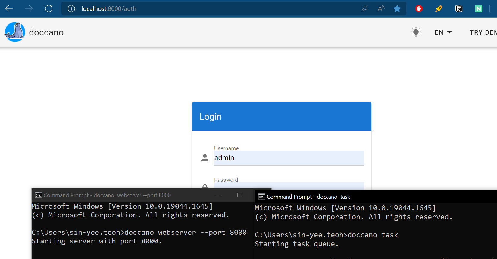

## Install Doccano
1. Five ways of installation (Local/Cloud)
    - pip install doccano
    - Install with Docker
    - Install with Docker Compose
    - Install from source
    - Install to cloud

2. I will show the steps to install with pip.
    - [Refer here](https://doccano.github.io/doccano/install-and-upgrade-doccano/) if you want to try other way of installation

Requirement: Python 3.8+

### Install with pip
1. Open your terminal/command prompt and run: 
```
pip install doccano
```
3. You need to run this command to initialize database. (Do for the first time ONLY)
```
doccano init
```
4. Create a super user. (Do for the first time ONLY)
```
doccano createuser --username admin --password pass
```
Afterwards, you need to use the credentials above to login Doccano web.

DONE INSTALLATION!

### Start Doccano server 
1. You need to run TWO commands before you can use Doccano (Repeat steps 2-4 everytime when you want to use Doccano!)
2. Start a web server.
```
doccano webserver --port 8000
```
3. Open another terminal to Start the task queue to handle file upload/download
```
doccano task
```
4. Open http://localhost:8000/.

_Snapshot after running Doccano successfully_ <br>

